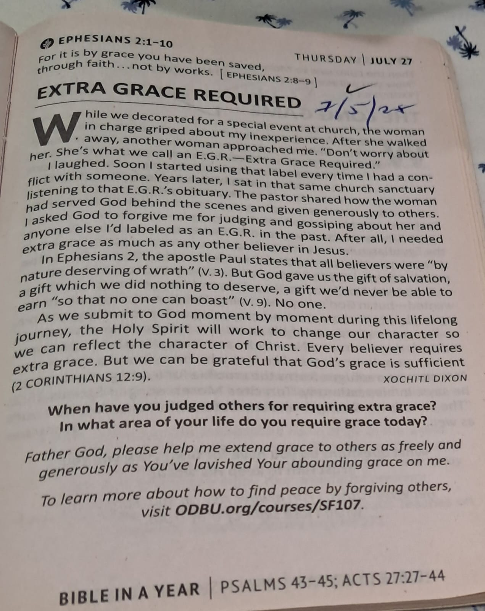

[9:37 AM, 7/27/2025] Claudette Deborah Bacchas: Gm. This is your devotion for this week. Donot concentrate on any other theme but GRACE.
1. Get a note book
2. Name it GRACE 
3. Find  ALL the passage that deals with Grace
4. This week we will concentrate only on GOD'S GRACE
[9:37 AM, 7/27/2025] Claudette Deborah Bacchas: Your Bible Study too. Ephesians 2:1-10
[9:44 AM, 7/27/2025] Claudette Deborah Bacchas: Greetings Bro Rose. Sharing my morning devotion with you

